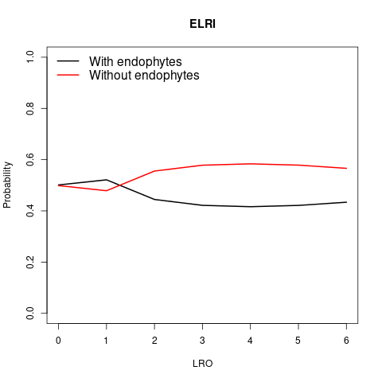
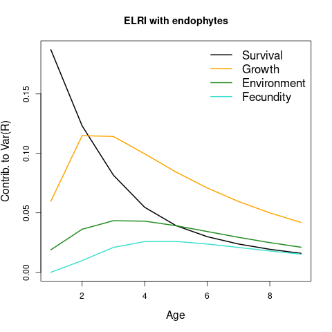
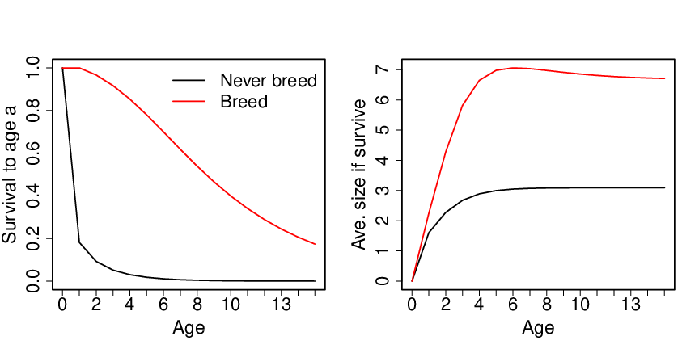

```{r, include = FALSE}
knitr::opts_chunk$set(
  collapse = TRUE,
  comment = "#>"
)
```

**Study background** This vignette involves perennial grasses with and
without endophytes.  We use the size-structured matrix model for
*Elymus villosus* (labeled as "ELRI" in data objects and figures) from @2024:fowle.ziegl.whitn.ea, which includes
transition matrices for 13 years.  The model is in turn based on data
from a long-term symbiont removal experiment at Lilly-Dickey Woods in
Indiana, USA [@2023:mille.fowle.ziegl.ea].

**Model Components (Input Variables for luckieR functions)**:

* PlistAllEndo: a list of lists containing the yearly transition
matrices: PlistAllEndo[[1]] is a list of yearly transition matrices
for plants with endophytes and PlistAllEndo[[2]] is the same for
plants without endophytes

* FlistAllEndo: a list of lists containing the yearly fecundity
matrices, with the same structure as PlistAllEndo

* Q: the transition matrix between year types.  (Here we assume that year
types are drawn randomly with replacement.)

* c0: The initial size distribution.  (Here all individuals are born
  into size class 1, the seedling size class, so c0[1] = 1 and all
  other entries are 0.)

* maxClutchSize: the maximum number of offspring that can be produced
  in a single reproductive bout

* maxLRO: the maximum lifetime reproductive output

* traitDist: the probability distribution for trait values.  Here we
  assume that plants are equally likely to have endophytes or not, so
  traitDist = c(0.5, 0.5).

* Fdist: the probability distribution for the clutch size, with
  current options "Poisson" and "Bernoulli".  Here we assume
  "Poisson". 

**Predicting an individual's trait(s) based on a known lifetime outcome** 

One question we may wish to ask is how certain we are of an
individual's endophyte status based on their lifetime reproductive
output (LRO).  In order to make the code less glacially slow,
we use an abridged version of the model, with only three year
types.  (WARNING: this code is still slow.)  For this species ("ELRI" shown in the figure below), not
having endophytes produces higher LRO, but even if we observe an
individual with 6 offspring (which is well into the 90th percentile),
we can't be very confident that that individual lacked endophytes. 
For more details on the math behind this calculation, see
@2018:snyde.ellne and @2024:snyde.ellne.

```{r, echo=FALSE, fig.align="center", out.width="70%"} 

```

Here is the code to produce the above figure about probability of a given trait given an individual's observed LRO, which you can adapt to conduct a similar analysis on your own data:

```{r, eval=FALSE}
library ("luckieR")
maxClutchSize = 24
maxLRO = 24
groupDist = rep (0.5, 2)

## read in matrices
PlistAllEndo = readRDS ("ELRIPMatrices.rds")
FlistAllEndo = readRDS ("ELRIFMatrices.rds")

## find number of year types
numEnv = length(PlistAllEndo[[1]])

## Assume that all env. are equally likely and the sequence is
## temporally uncorrelated.  You can make other choices if you have
## more information.
Q = matrix (1/numEnv, numEnv, numEnv)

## How many states do we have in each env.?
mz = dim(PlistAllEndo[[1]][[1]])[1]

bigmz = mz * numEnv

## Initial state distrib.
c0 = rep (0, mz); c0[1] = 1

## Clutch size distribution
Fdist = "Poisson"

## Equally likely to have endophytes or not
traitDist = rep (0.5, 2)

out = probTraitCondLRO (PlistAllEndo, FlistAllEndo, Q,
                        c0, maxClutchSize, maxLRO,
                        traitDist, Fdist)

probXCondR = out$probXCondR

matplot (0:6, probXCondR[1:7,], xlab="LRO",
         ylab="Probability", type="l", col=c("black", "red"), lwd=2,
         lty=1, main="ELRI", ylim=c(0,1))

legend (x="topleft", col=c("black", "red"),
        legend=c("With endophytes", "Without endophytes"),
        lwd=2, bty="n", cex=1.3)
```

**Partitioning variance**

Alternatively, we may wish to focus on what forms of luck are most
important and at what ages.  If we partition the variance in LRO into
a within-endophyte-status contribution and a between-endophyte-status
contribution, we can think of the within-endophyte-status contribution
as the contribution of luck [@2018:snyde.ellne].  We can further
partition that luck contribution into contributions from individual
demographic transitions at different ages.  Did you survive from age 2
to age 3 and how much does knowing the outcome reduce the overall
variance?  If you lived, how much did you grow or shrink and how much
does knowing the outcome reduce the overall variance?  And so forth.
The amount that knowing the outcome of each of these demographic
transitions reduces the overall variance is the contribution that
transition makes.

We see that early survival luck is key and this makes sense: if you
die young, it doesn't matter how lucky you would have been later.  We
also see that growing quickly at ages 2 and 3 is important.  Survival
rises rapidly with size for this species, so this too, makes sense.
(Note: in order to make the code slow, we use an abridged version of
the model, with only three year types.)  For the mathematical details
behind this calculation, see @2024:snyde.ellne.

```{r, echo=FALSE, fig.align="center", out.width="70%"} 

```

Here is the code to produce the variance partition figure: 

```{r, eval=FALSE}
library ("luckieR")
maxClutchSize = 24
maxLRO = 24
groupDist = rep (0.5, 2)

## read in matrices
PlistAllEndo = readRDS ("ELRIPMatrices.rds")
FlistAllEndo = readRDS ("ELRIFMatrices.rds")

## find number of year types
numEnv = length(PlistAllEndo[[1]])

## Assume that all env. are equally likely and the sequence is
## temporally uncorrelated.  You can make other choices if you have
## more information.
Q = matrix (1/numEnv, numEnv, numEnv)

## How many states do we have in each env.?
mz = dim(PlistAllEndo[[1]][[1]])[1]

bigmz = mz * numEnv

## Initial state distrib.
c0 = rep (0, mz); c0[1] = 1
## Initial env. distrib.  Should probably be the stationary distribution.
u0 = rep (1/numEnv, numEnv)

## We have two traits: endophyte-positive and -negative
numTraits=2
## Maximum age
maxAge = 25

## Equally likely to have endophytes or not
traitDist = rep (0.5, 2)

out = partitionVarSkewnessEnvVarAndTraits (PlistAllEndo,
                                           FlistAllEndo,
                                           Q, c0, traitDist, maxAge,
                                           survThreshold=0.05)

varTrajecResults = array (NA, dim=c(numTraits, 4, maxAge))
varTrajecResults[,1,] = out$survTrajecVarCondX
varTrajecResults[,2,] = out$growthTrajecVarCondX
varTrajecResults[,3,] = out$envTrajecVarCondX
varTrajecResults[,4,] = out$fecVarCondX

colorVec = colorVecAll6[2:5]
matplot (1:9, t(varTrajecResults[1,,1:9]),
         xlab="Age", ylab="Contrib. to Var(R)", type="l",
         main="ELRI with endophytes", lwd=2,
	 col=c("black", "orange", "forest green", "turquoise"),
	 lty=1, cex.lab=1.3)

legend (x="topright", lwd=2,
        col=c("black", "orange", "forest green", "turquoise"),
        legend=c("Survival", "Growth", "Environment", "Fecundity"),
        lty=1, cex=1.4, bty="n")
```

**Conditional distributions**

As a final example, let us plot survival fraction and average size vs
age for those destined to have at least one offspring and for those
who will never have any offspring, as a way of understanding what is
different about successful breeders.  To do this, we need to calculate
the survival/growth transition matrices conditional on having at least
one offspring.  We see that that most of those who never breed fail
because they do not survive the seedling stage (age 0), and of those
that do, those that never breed do not grow as large as those who do.
Survival increases sharply with size for this species, so growing
large quickly increases survival, not just fecundity.  For the
mathematical details behind this calculation, see @2018:snyde.ellne.

```{r, echo=FALSE, fig.align="center", out.width="100%"} 

```

```{r, eval=FALSE}
library ("luckieR")
maxClutchSize = 24
maxLRO = 24
groupDist = rep (0.5, 2)

## read in matrices
PlistAllEndo = readRDS ("ELRIPMatrices.rds")
FlistAllEndo = readRDS ("ELRIFMatrices.rds")

## Work with endophyte-positive individuals for this example.
Plist = PlistAllEndo[[1]]
Flist = FlistAllEndo[[1]]

## find number of year types
numEnv = length(PlistAllEndo[[1]])

## Assume that all env. are equally likely and the sequence is
## temporally uncorrelated.  You can make other choices if you have
## more information.
Q = matrix (1/numEnv, numEnv, numEnv)

## How many states do we have in each env.?
mz = dim(PlistAllEndo[[1]][[1]])[1]

bigmz = mz * numEnv

## Initial state distrib.
c0 = rep (0, mz); c0[1] = 1
## Initial env. distrib.  Should probably be the stationary distribution.
u0 = rep (1/numEnv, numEnv)
## Initial cross-classified state (size x env.)
m0 = matrix (outer (c0, as.vector(u0)), bigmz, 1)

## Maximum age
maxAge = 15

aveSizeCondBreedAndSurv = aveSizeCondNeverBreedAndSurv =
  fracSurvCondBreed = fracSurvCondNeverBreed = rep (0, maxAge+1)

## Calculate fecundity and size/growth transition matrices for
## cross-classified states (size x env.)
F = M = matrix (0, bigmz, bigmz)
for (i in 1:numEnv) {
  for (j in 1:numEnv) {
    M[(i-1)*mz + 1:mz, (j-1)*mz + 1:mz] = Plist[[j]]*Q[i,j]
    F[(i-1)*mz + 1:mz, (j-1)*mz + 1:mz] = Flist[[j]]*Q[i,j]
  }
}

## Find M conditional on having at least one offspring
out = makePCondBreedDef3 (M, F, m0)

## Kernel conditional on breeding
MCondBreed = out$PCondBreed
## Kernel conditional on never breeding
MCondNeverBreed = out$PCondNeverBreed
## Initial state conditional on breeding
esM0CondBreed = out$bigc0CondBreed
## Initial state conditional on neverbreeding
esM0CondNeverBreed = out$bigc0CondNeverBreed

## State distrib. at age a. (Here a = 0.)
MaM0CondBreed = esM0CondBreed
MaM0CondNeverBreed = esM0CondNeverBreed

sizeVec = rep(0:(mz-1), numEnv)
esSizeVec = rep(sizeVec, 3)
## Loop over ages
for (a in 0:maxAge) {
  ## What fraction of the population is alive?
  fracSurvCondBreed[a+1] = sum(MaM0CondBreed)
  fracSurvCondNeverBreed[a+1] = sum(MaM0CondNeverBreed)
  ## What is the average size?
  aveSizeCondBreedAndSurv[a+1] = sum(MaM0CondBreed * esSizeVec) /
    fracSurvCondBreed[a+1]
  aveSizeCondNeverBreedAndSurv[a+1] = sum(MaM0CondNeverBreed * sizeVec) /
    fracSurvCondNeverBreed[a+1]
  ## Update state distribution
  MaM0CondBreed = MCondBreed %*% MaM0CondBreed
  MaM0CondNeverBreed = MCondNeverBreed %*% MaM0CondNeverBreed
}

## which age is closest to having 10% of the population left?
fewLeftCondBreed = which.min (abs (fracSurvCondBreed - 0.1))
fewLeftCondNeverBreed = which.min (abs (fracSurvCondNeverBreed -
                                             0.1))

xmax = max(fewLeftCondNeverBreed, fewLeftCondBreed)
pdf (height=6, width=12, file="condKernelPlots.pdf")
par (cex.lab=1.9, cex.axis=1.8, lwd=2, mfrow=c(1,2),
     oma=c(0,0,1,0), mar=c(5.1,4.5,4.1,2.1))
plot (0:(xmax-1), fracSurvCondNeverBreed[1:xmax], type="l", xlab="Age",
      ylab="Survival to age a", xaxt="n")
lines (0:(xmax-1), fracSurvCondBreed[1:xmax], col="red")
axis (side=1, at=0:(xmax-1), labels=0:(xmax-1))
legend (x="topright", col=c("black", "red"),
        legend=c("Never breed", "Breed"), lwd=2, bty="n",
        cex=1.8)

ymax = max (aveSizeCondNeverBreedAndSurv, aveSizeCondBreedAndSurv)
plot (0:(xmax - 1), aveSizeCondNeverBreedAndSurv[1:xmax],
      type="l", xlab="Age", xaxt="n",
      ylab="Ave. size if survive",
      ylim=c(0, ymax))
axis (side=1, at=0:(xmax-1), labels=0:(xmax-1))
lines (0:(xmax-1), aveSizeCondBreedAndSurv[1:xmax],
       type="l", col="red")
```
